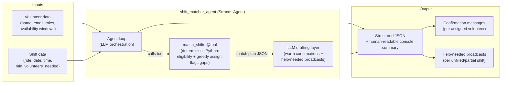

# Architecture

## Problem being solved

Food banks and small nonprofits chronically have unfilled volunteer shifts — not
because volunteers don't exist, but because manually matching volunteer
availability/skills to open shifts (via spreadsheets or group texts) is slow and
error-prone for a coordinator who is already stretched thin. This system
automates that matching and drafts the outreach messages.

## Data flow

## How data flows through the system (in words)

Volunteer data and shift data enter the `shift_matcher_agent`, a Strands agent
built on the Strands Agents SDK. The agent's LLM loop first calls the
deterministic `match_shifts` custom tool, which performs the actual eligibility
checking and greedy assignment in pure Python — making the "who is assigned to
what" decision auditable and reproducible rather than an LLM guess. The agent
then feeds that structured match plan into its LLM drafting layer, which writes
warm per-volunteer confirmation messages and, for any shift the tool flagged as
partially filled or unfilled, a friendly "help needed" broadcast describing the
specific gap. Finally, the CLI prints both a structured JSON object and a clean
human-readable summary to the console.
