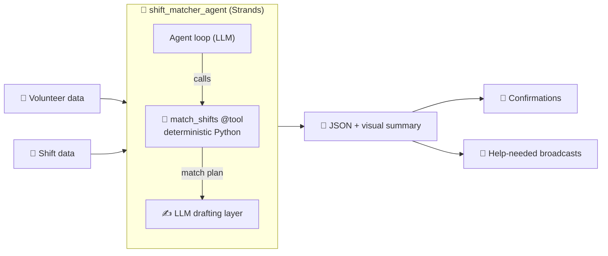

<!--
╔══════════════════════════════════════════════════════════════════════════╗
║  builder.aws.com submission — copy each field into the matching editor box ║
║                                                                            ║
║  TITLE (≤255):                                                             ║
║    Agents for Humans: Building a Volunteer Shift Matcher with the          ║
║    Strands Agents SDK                                                      ║
║                                                                            ║
║  DESCRIPTION (≤512):                                                       ║
║    How I built an AI agent that fills a food bank's empty volunteer        ║
║    shifts in seconds — using a deterministic Strands tool for auditable    ║
║    matching and Amazon Bedrock to draft the warm, human outreach.          ║
║                                                                            ║
║  TAGS (≤5):  strands-agents, amazon-bedrock, generative-ai, python,        ║
║              streamlit                                                     ║
║                                                                            ║
║  CANONICAL URL:  (leave blank — first published here)                      ║
║                                                                            ║
║  BODY:  everything below this comment is the article body — paste as-is.   ║
╚══════════════════════════════════════════════════════════════════════════╝
-->

> ### 🤝 Volunteer Shift Matcher
> **Fill a food bank's volunteer shifts in seconds.** An AI agent that builds an auditable match plan, drafts warm confirmation messages, and writes *help-needed* broadcasts for any gap it can't fill.
>
> 🚀 **[Live demo](https://volunteer-shift-matcher.streamlit.app/)**  ·  📦 **[Code (MIT)](https://github.com/MakendranG/volunteer-shift-matcher)**  ·  🏘️ *Agents for Humans — Good Neighbor track*

---

## 🧭 TL;DR

| | |
|---|---|
| **Who it helps** | Volunteer coordinators at food banks & small nonprofits |
| **The pain** | Manually matching volunteer availability + skills to open shifts is slow and error-prone |
| **What it does** | Auto-matches volunteers → shifts, drafts confirmations, flags & broadcasts gaps |
| **How** | A deterministic Strands `@tool` for the facts + Amazon Bedrock (Claude) for the human voice |
| **Try it** | [Live app](https://volunteer-shift-matcher.streamlit.app/) · runs keyless, no sign-up |

---

## 💡 The problem that started it

I didn't start with an AI idea. **I started with a person.**

Picture the volunteer coordinator at a small food bank. She has a spreadsheet of who's free and when, a list of shifts that need covering this weekend, and a group chat that never stops buzzing. Every week she plays the same exhausting game: cross-referencing availability against skills against shift times, in her head, while doing five other jobs. Shifts fall through the cracks — and when a shift goes unfilled, **food doesn't get sorted and neighbors don't get served.**

That's the exact pain the *Good Neighbor Agents* track calls out: *"matching volunteers to the shifts a food bank actually needs."* So I wrote a one-sentence problem statement and refused to move until it was concrete:

> 📌 Food banks and small nonprofits chronically have unfilled volunteer shifts — not because volunteers don't exist, but because manually matching availability and skills to open shifts is slow and error-prone for a coordinator who is already stretched thin.

Everything I built traces back to that sentence.

---

## 🏗️ The architecture



The design in one line: **let deterministic code own the decisions that must be correct, and let the LLM own the language.**

---

## 🎯 The key design decision: deterministic tool + LLM drafting

The temptation with agents is to throw everything at the model: *"here are the shifts and volunteers, figure it out."* But volunteer scheduling is a place where a wrong answer has real consequences — you don't want an LLM hallucinating that someone is available when they're not.

So I split the work in two:

- 🧮 **A deterministic Python tool does the matching.** Role eligibility, full time-window coverage, no double-booking, and honest flagging of any shift that can't be filled — all in plain, auditable Python. A coordinator (or a judge) can read exactly *why* each decision was made.
- ✍️ **The LLM does what it's great at — the human touch.** It takes the verified plan and drafts warm, ready-to-send confirmations and "help needed" broadcasts.

That division is what makes it a **genuine agent** rather than a single prompt.

---

## 🛠️ Building it with the Strands Agents SDK

The Strands Agents SDK made this split almost trivial. A custom tool is just a decorated Python function:

```python
from strands import tool

@tool
def match_shifts(shifts: list[dict], volunteers: list[dict]) -> dict:
    """Deterministically match volunteers to open shifts and flag any gaps."""
    return compute_match_plan(shifts, volunteers)
```

And the agent wires that tool and a system prompt to a model:

```python
from strands import Agent
from strands.models import BedrockModel

agent = Agent(
    model=BedrockModel(
        model_id="global.anthropic.claude-sonnet-4-6",
        region_name="us-west-2",
        temperature=0.4,
    ),
    tools=[match_shifts],
    system_prompt=SYSTEM_PROMPT,  # "always call match_shifts, then draft messages…"
)
```

The system prompt tells the agent to **always** call `match_shifts` for the assignments (never guess), then draft the messages and return one structured JSON object. Strands runs the loop — *reason → call tool → compose* — and I get back both the structured plan and the natural language, every time.

---

## ☁️ Using AWS

The model provider is **Amazon Bedrock** (Claude Sonnet 4), the Strands default. A detail I'm proud of: **there are no hardcoded credentials anywhere.** The agent reads everything from the environment (or an IAM role), and `.env` is gitignored so no key can ever be committed.

That discipline paid off the moment I added a public demo.

---

## 🖥️ Making it real: a visual UI + a public demo

A CLI proves the agent works, but people want to *see* it. So I built a **Streamlit** front-end over the exact same agent: paste your shifts and volunteers, click one button, and get a colour-coded match plan, the drafted confirmations, and the help-needed broadcasts.

Then I deployed it free on **Streamlit Community Cloud** so anyone can try it: **[volunteer-shift-matcher.streamlit.app](https://volunteer-shift-matcher.streamlit.app/)**

Here's the security decision I'm most happy with. A public app carrying my AWS keys would let the whole internet spend my Bedrock budget. So the public demo runs **keyless** — it auto-detects the absence of credentials and defaults to an offline deterministic mode that still shows the full matching. Anyone who wants the *real* Bedrock experience can paste their **own temporary STS credentials** — held only in their browser session, never stored, billed to their own account.

> 🔒 A web app can't borrow your AWS Console login — browser cross-site isolation forbids it — so short-lived STS credentials are the correct, secure equivalent.

---

## 🧠 The insight that made the demo honest

Early on, my sample data made every shift fill perfectly. It looked great — and it was misleading. Real coordinators don't live in a perfect world.

So I deliberately engineered the data so one shift — a **Saturday driver slot needing two people** — can only be half-filled. Now the demo shows the feature that actually matters: the agent flags the gap…

> 📣 *"Hi neighbors! We still need 1 more person for Saturday driver, 10am–1pm. If you can lend a hand, please reply here — every bit helps. Thank you!"*

…and drafts the broadcast to close it. **Handling the imperfect case *is* the product.**

---

## 🚀 What I'd do next

- 🔁 Two-way integration: send confirmations over SMS/Slack and ingest replies
- 📆 Recurring shifts and volunteer reliability history
- 🎚️ A "regenerate in a warmer/shorter tone" button, powered by the same agent
- ⚙️ Optional deploy to Amazon Bedrock AgentCore Runtime for a managed endpoint

---

## ✅ Takeaways for other builders

1. **Start with a person, not a prompt.** A one-sentence problem statement kept every decision honest.
2. **Split facts from language.** Deterministic code for what must be correct; the LLM for the human voice.
3. **Design your demo around the imperfect case** — that's where the value shows.
4. **Never ship keys.** Env vars + gitignored `.env` + a keyless public demo = open-source with zero anxiety.

Strands made the agent the *easy* part — a decorated function and a few lines to wire it up — which freed me to focus on what makes a Good Neighbor Agent genuinely good: **correctness, honesty about gaps, and a warm voice.**

---

**🚀 Try it:** [volunteer-shift-matcher.streamlit.app](https://volunteer-shift-matcher.streamlit.app/)  ·  **📦 Code:** [github.com/MakendranG/volunteer-shift-matcher](https://github.com/MakendranG/volunteer-shift-matcher)

*Built for the Agents for Humans hackathon — Good Neighbor Agents track. Uses only synthetic sample data; no real personal information.*
